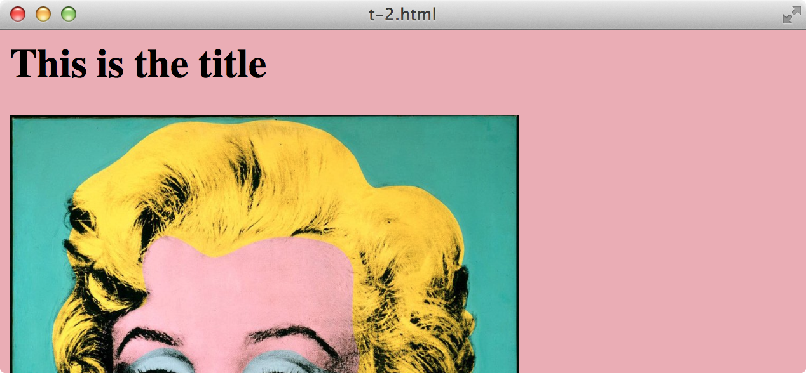
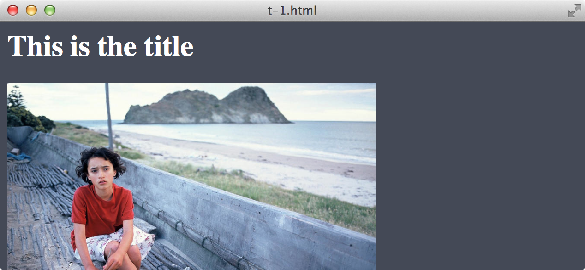

# color-machine

color-machine is experimental web service that receives URL to image and generates responding CSS with
foreground and background colors that just work well together and are readable. **work in progress**

- [Oto Brglez](https://github.com/otobrglez)

## Resources

- http://www.barelyfitz.com/projects/csscolor/
- http://slayeroffice.com/tools/color_palette/
- http://www.stuffandnonsense.co.uk/archives/creating_colour_palettes.html
- http://charlesleifer.com/blog/using-python-and-k-means-to-find-the-dominant-colors-in-images/
- https://github.com/halostatue/color
